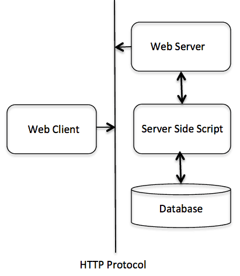
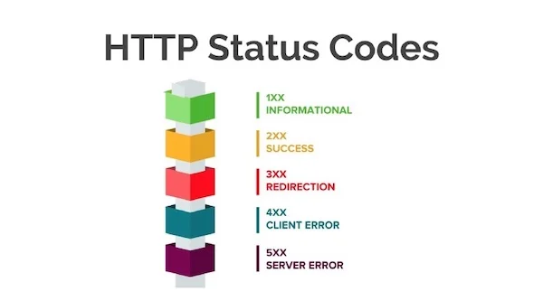
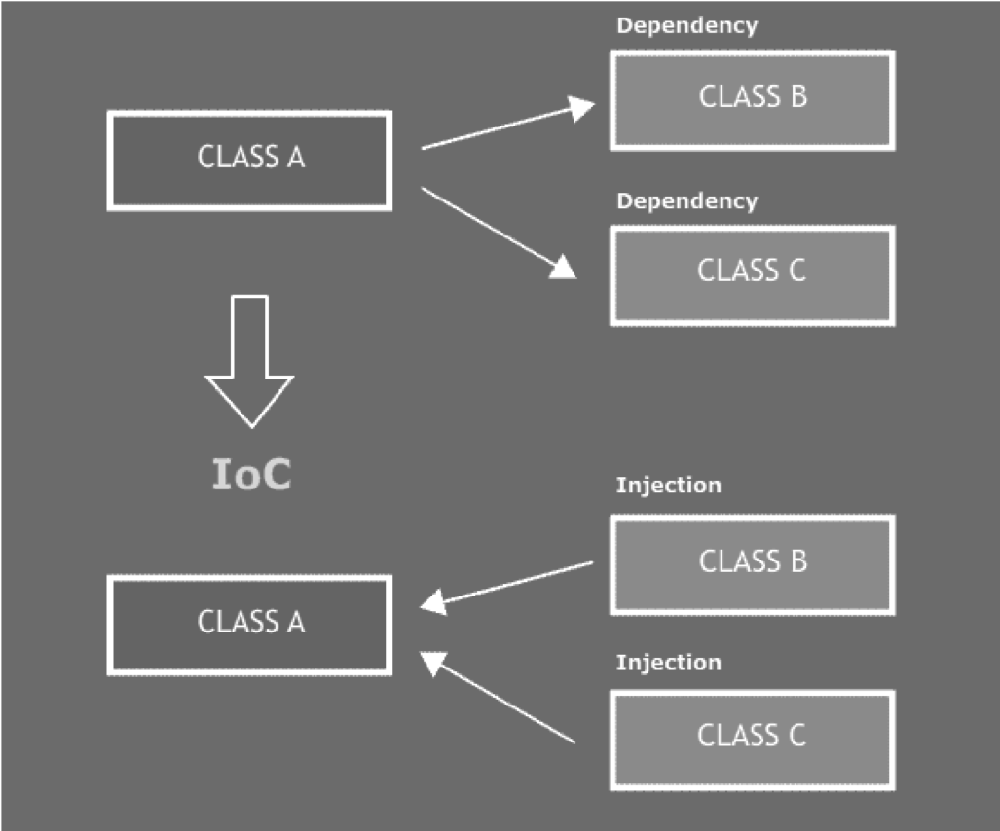

- API là gì, RestAPI là gì ? 
- HTTP là gì ?
- Các method trong HTTP
- Reponse là gì, Request là gì ?
- Design patern : DI, IOC
- (Không bắt buộc) Coding convention

# 1. API là gì, RestAPI là gì?
API (Application Programming Interface) là một tập hợp các quy tắc và giao thức cho phép các ứng dụng khác nhau giao tiếp và tương tác với nhau. API định nghĩa cách các phần mềm hoặc các dịch vụ có thể yêu cầu và trao đổi dữ liệu với nhau. Nó giống như một cầu nối cho phép các hệ thống và ứng dụng "nói chuyện" với nhau mà không cần phải biết rõ về cách hoạt động bên trong của nhau.

REST API (Representational State Transfer API) là một loại API sử dụng các nguyên tắc của kiến trúc REST (Representational State Transfer). REST là một phong cách thiết kế phần mềm cho các dịch vụ web, và REST API là một cách để cung cấp dịch vụ web thông qua các giao thức HTTP/HTTPS. Một số đặc điểm chính của REST API bao gồm:

Stateless: Mỗi yêu cầu từ client đến server phải chứa tất cả thông tin cần thiết để server hiểu và xử lý yêu cầu đó. Server không lưu trữ trạng thái của client giữa các yêu cầu.

Cấu trúc dữ liệu chuẩn: REST API thường sử dụng định dạng JSON hoặc XML để trao đổi dữ liệu giữa client và server.

Phương thức HTTP: REST API thường sử dụng các phương thức HTTP như GET (lấy dữ liệu), POST (gửi dữ liệu), PUT (cập nhật dữ liệu), DELETE (xóa dữ liệu) để thực hiện các thao tác trên tài nguyên.

URL làm điểm truy cập: Các tài nguyên trong REST API được định danh thông qua các URL cụ thể, và các thao tác trên các tài nguyên này được thực hiện qua các phương thức HTTP.

Ví dụ, một REST API có thể cung cấp các điểm truy cập như /users để lấy danh sách người dùng hoặc /users/{id} để lấy thông tin chi tiết của một người dùng cụ thể.

REST API rất phổ biến trong phát triển ứng dụng web và di động nhờ vào sự đơn giản và khả năng mở rộng của nó.

# 2. HTTP là gì
**HTTP** là từ viết tắt của **Hyper Text Transfer Protocol** nghĩa là Giao thức Truyền tải Siêu Văn Bản được sử dụng trong **www.** HTTP là 1 giao thức cho phép tìm nạp tài nguyên, chẳng hạn như HTML doc. Nó là nền tảng của bất kỳ sự trao đổi dữ liệu nào trên Web và cũng là giao thức giữa client (thường là các trình duyệt hay bất kỳ loại thiết bị, chương trình nào) và server (thường là các máy tính trên đám mây).

- Lịch sử hình thành: 
  - HTTP 1: 1996 
  - HTTP 1.1: pipeline - 1997
  - HTTP 2: streams - 2015
  - HTTP 3: QUIC - 2022 
- 3 đặc điểm của HTTP:
  - Tính đơn giản: đc thiết kế đơn giản và thân thiện với người đọc, giúp việc testing đỡ phức tạp
  - Khả năng mở rộng: 
  - Tính stateless chứ không phải sessionless: HTTP là một giao thức stateless, có nghĩa là mỗi yêu cầu từ client đến server là độc lập và không liên quan đến các yêu cầu trước đó. Mỗi yêu cầu phải chứa toàn bộ thông tin cần thiết để xử lý yêu cầu.



# 3. Các phương thức trong HTTP
HTTP định nghĩa 1 số phương thức, mỗi phương thức phục vụ một mục đích cụ thể trong việc xử lý các yêu cầu(request) và phản hồi(response) tài nguyên. Các phương thức HTTP phổ biến nhất bao gồm: GET, POST, PUT, DELETE, HEAD, OPTIONS, CONNECT và TRACE.

**HTTP GET:**
Phương thức này dùng để lấy tài nguyên từ server, các request giống nhau thì server sẽ trả về cùng 1 kết quả. Ví dụ: nếu bạn gửi đồng thời nhiều request để lấy dữ liệu theo cùng 1 điều kiện thì kết quả bạn nhận được sẽ giống nhau.

```Java
GET /api/users?id=123
```
**HTTP PUT:**
Phương thức này được dùng để cập nhật hoặc tạo một tài nguyên(resource) trên server, các request giống nhau sẽ cập nhật cùng một tài nguyên.
```Java
PUT /api/users/123
Content-Type: application/json

{
  "name": "Updated Name",
  "email": "updated@example.com"
}
```
**HTTP POST:**
Phương thức này thường được dùng để gửi dữ liệu cần xử lý đến một tài nguyên được chỉ định. Không giống như GET, phương thức POST không thêm dữ liệu vào URL; thay vào đó, nó sẽ gửi dữ liệu trong request body. Điều này cho giúp nó phù hợp để gửi dữ liệu lớn hoặc dữ liệu có thông tin nhạy cảm. Phương thức POST được sử dụng khi bạn muốn gửi một số dữ liệu đến máy chủ, ví dụ như cập nhật thông tin, gửi dữ liệu của 1 form, v.v. Trong trường hợp tạo mới, nếu bạn gửi 2 request POST giống nhau thì tài nguyên sẽ được tạo 2 lần trên server.

```Java
POST /api/users
Content-Type: application/json

{
  "name": "John Doe",
  "email": "john@example.com"
}
```
**HTTP DELETE:**
Phương thức này thường được dùng để xóa tài nguyên trên server, nhiều request giống nhau thì sẽ xóa cùng 1 tài nguyên. Ví dụ: bạn gửi nhiều request xóa user theo ID bằng 123 thì tất cả các request này chỉ thực hiện việc xóa với user có ID = 123.

```Java
DELETE /api/users/123
```
**HTTP PATCH:**
Phương thức này được dùng để sửa đổi 1 phần(partial) cho tài nguyên. Phương thức này hiệu quả hơn PUT khi chỉ cập nhật các trường cụ thể của resource.

```Java
PATCH /api/users/123
Content-Type: application/json
{
  "email": "newemail@example.com"
}
```
**HTTP HEAD:**
Phương thức HEAD tương tự như GET, nhưng nó chỉ truy xuất các thông tin headers của tài nguyên mà không có dữ liệu thực tế(không có reponse body). Nó hữu ích khi bạn cần kiểm tra các thông tin header trước khi thực hiện tải xuống toàn bộ resource.

**HTTP CONNECT:**
Phương thức CONNECT sẽ thiết lập một kết nối mạng tới máy chủ được xác định bởi tài nguyên đích(target resource).

**HTTP OPTIONS:**
Phương thức này được sử dụng để xác định các tùy chọn giao tiếp cho một tài nguyên nhất định. Nó giúp cho client hiểu các phương thức HTTP và header nào được hỗ trợ.

```Java
OPTIONS /api/users
```
**HTTP TRACE:**
Phương thức này thực hiện kiểm tra vòng lặp(loop-back) dọc theo đường dẫn đến tài nguyên đích.

# 4. Response & Request
## 4.1 Request (Yêu cầu)
là thông điệp gửi từ client (như trình duyệt web, ứng dụng di động, hoặc một chương trình) đến server để yêu cầu một hành động nào đó hoặc để lấy thông tin.

Một yêu cầu HTTP thường bao gồm các phần sau:

#### 1. Request Line (Dòng yêu cầu):

Method: Phương thức HTTP, ví dụ GET, POST, PUT, DELETE, v.v.
URL: Địa chỉ của tài nguyên trên server mà client muốn truy cập.
HTTP Version: Phiên bản của giao thức HTTP được sử dụng (ví dụ, HTTP/1.1).
Ví dụ: GET /index.html HTTP/1.1

Request Headers (Tiêu đề yêu cầu):

Thông tin bổ sung về yêu cầu, như loại dữ liệu mà client có thể xử lý (Accept), thông tin về client (User-Agent), và các chi tiết khác.
Ví dụ:
```Java
Accept: text/html
User-Agent: Mozilla/5.0
```

#### 2. Request Body (Thân yêu cầu):

(Có thể có hoặc không tùy thuộc vào phương thức yêu cầu) Dữ liệu gửi từ client đến server, thường thấy trong các yêu cầu POST hoặc PUT.
Ví dụ: Dữ liệu biểu mẫu trong một yêu cầu POST để đăng ký người dùng.

## 4.2 Response (Phản hồi)
là thông điệp gửi từ server trở lại client sau khi xử lý yêu cầu. Nó chứa thông tin về kết quả của yêu cầu và có thể bao gồm dữ liệu mà client yêu cầu.

Một phản hồi HTTP thường bao gồm các phần sau:
#### 1. Status Line (Dòng trạng thái):

**HTTP Version:** Phiên bản của giao thức HTTP được sử dụng (ví dụ, HTTP/1.1).
**Status Code:** Mã trạng thái HTTP cho biết kết quả của yêu cầu (ví dụ, 200 OK, 404 Not Found, 500 Internal Server Error).


#### 2. Response Headers (Tiêu đề phản hồi):

Thông tin bổ sung về phản hồi, như loại nội dung (Content-Type), kích thước dữ liệu (Content-Length), và các chi tiết khác.
Ví dụ:
```Java
Content-Type: text/html
Content-Length: 1234
```
#### 3. Response Body (Thân phản hồi):

Dữ liệu thực tế được gửi từ server về client. Đây có thể là nội dung của trang web, dữ liệu JSON từ một API, hình ảnh, hoặc bất kỳ loại dữ liệu nào khác.

Ví dụ: Nội dung HTML của trang web hoặc dữ liệu JSON của một đối tượng người dùng.

Trong quá trình trao đổi, client gửi yêu cầu để truy cập tài nguyên hoặc thực hiện hành động, và server phản hồi với thông tin hoặc dữ liệu cần thiết, cùng với mã trạng thái cho biết kết quả của yêu cầu.

# 5. DI, Dependency Inversion, IoC
## 5.1 DI
**Dependency injection (DI)** là một kỹ thuật lập trình giúp tách một class độc lập với các biến phụ thuộc. Với lập trình hướng đối tượng, chúng ta hầu như luôn phải làm việc với rất nhiều class trong một chương trình. Các class được liên kết với nhau theo một mối quan hệ nào đó. Dependency là một loại quan hệ giữa 2 class mà trong đó một class hoạt động độc lập và class còn lại phụ thuộc bởi class kia.

#### Phân loại: 
Thông thường, chúng ta chỉ thường gặp ba loại Dependency Injection sau:
- Constructor injection: Các dependency (biến phụ thuộc) được cung cấp thông qua constructor (hàm tạo lớp).
- Setter injection: Các dependency (biến phụ thuộc) sẽ được truyền vào 1 class thông qua các setter method (hàm setter).
-  Interface injection: Dependency sẽ cung cấp một Interface, trong đó có chứa hàm có tên là Inject. Các client phải triển khai một Interface mà có một setter method dành cho việc nhận dependency và truyền nó vào class thông qua việc gọi hàm Inject của Interface đó.

#### Nhiệm vụ của Dependency Injection:
- Tạo ra các object.
- Biết được class nào cần những object đấy.
- Cung cấp cho những class đó những object chúng cần.

#### Quy tắc:
- Các class sẽ không phụ thuộc trực tiếp lẫn nhau mà thay vào đó chúng sẽ liên kết với nhau thông qua một Interface hoặc base class (đối với một số ngôn ngữ không hỗ trợ Interface).
- Việc khởi tạo các class sẽ do các Interface quản lí thay vì class phụ thuộc nó.

#### Ví dụ
Giả sử, chúng ta có một class `Car`, trong đó có vài object khác như `Wheel`, hay `Battery`:
```Java
class Car{
  private Wheels wheel = new MRFWheels();
  private Battery battery = new ExcideBattery();
  ...
  ...
}
```
**Vấn đề:** Ở đây, class Car chịu trách nhiệm khởi tạo tất cả các dependency object. Nhưng chuyện gì sẽ xảy ra nếu chúng ta muốn bỏ MRFWheels và thay thế bằng BMWWheels.

**Dependency Injection** là một dạng design pattern được thiết kế nhằm ngăn chặn sự phụ thuộc nêu trên, khi sử dụng dependency injection, chúng ta có thể đổi `wheel` ở runtime vì dependency có thể được truyền vào (inject) ở runtime thay vì complile time, điều này giúp giảm chi phí trong việc sửa đổi và nâng cấp hệ thống. Nhờ vậy khi bạn thực thiện thay đổi một class A thì những class chứa biến kiểu class A cũng không cần phải thay đổi theo. 

Có thể hiểu là **dependency injection** là một người trung gian chịu trách nhiệm tạo ra các loại `wheel` khác nhau, rồi cung cấp chúng cho class Car. Việc đó làm cho class Car ko phải phụ thuộc vào `Wheels` cụ thể nào hay `Battery` cụ thể nào nữa.

```Java
class Car{
  private Wheels wheel;
  private Battery battery;
  
  /*Ở đâu đó trong project, ta khởi tạo những objects mà đc yêu cầu bởi class này
    Có 2 cách để implement dependency injection
    1. Dựa vào constructor
    2. Dựa vào Setter method
  */
  
  // Dựa vào constructor
  Car(Wheel wh, Battery bt) {
    this.wh = wh;
    this.bt = bt;
  }
  
  // Dựa vào Setter method
  void setWheel(Batter bt){
    this.bt = bt;
  }
  ...  
  ...
}
```

#### Lợi ích
- Dễ test và viết Unit Test: Dễ hiểu là khi ta có thể Inject các dependency vào trong một class thì ta cũng dễ dàng “tiêm” các mock object vào class (được test) đó.
- Dễ dàng thấy quan hệ giữa các object: Dependency Injection sẽ inject các object phụ thuộc vào các interface thành phần của object bị phụ thuộc nên ta dễ dàng thấy được các dependency của một object.
- Dễ dàng hơn trong việc mở rộng các ứng dụng hay tính năng.
- Giảm sự kết dính giữa các thành phần, tránh ảnh hưởng quá nhiều khi có thay đổi nào đó.

#### Bất lợi
- Rất nhiều các lỗi ở compile time có thể bị đẩy sang runtime, dẫn đến đôi khi sẽ khó debug. Vì sử dụng các Interface nên có thể gặp khó khăn khi ta debug source code vì không biết implement nào thực sự được truyền vào.
- Có thể làm ảnh hưởng tới chức năng auto-complete hay find references của một số IDE. Cụ thể vì Dependency Injection ẩn các dependency nên một số lỗi chỉ xảy ra khi chạy chương trình thay vì có thể phát hiện khi biên dịch chương trình.
- Khó khăn lớn nhất là khi người mới vào làm bằng DI sẽ không hiểu rõ ràng tư tưởng, khiến quá trình làm DI vẫn bị nhập nhằng và các injector bị ràng buộc mà không thoát hẳn ra theo tư tưởng của DI.

## 5.2 Dependency Inversion
Quy tắc cuối trong SOLID: Dependency Inversion principle
**Dependency Inversion** là quy tắc lập trình mà trong đó modules cấp cao không nên phụ thuộc vào module cấp thấp, mà cả module cấp cao và module cấp thấp nên phụ thuộc vào abstraction. Ngoài ra, nguyên tắc Dependency Inversion còn quy định rằng các class phải giao tiếp với nhau thông qua giao diện (interfaces) chứ không được qua implementation

## 5.3 Ioc
**Inversion of Control (IoC)** là một nguyên lý thiết kế trong công nghệ phần mềm trong đó các thành phần nó dựa vào để làm việc bị đảo ngược quyền điều khiển khi so sánh với lập trình hướng thủ thục truyền thống.
Hình bên là Class A ở hai trường hợp, áp dụng IoC và không. Lớp này nó làm việc phụ thuộc vào hai lớp Class B và Class C (B và C gọi là các dependency)

- Ở mô hình không IoC, Class A khi cần chủ động tạo ra đối tượng lớp Class B và Class C (nó nắm quyền khởi tạo, điều khiển)
- Với mô hình IoC thì class A không tự khởi tạo cũng không chịu trách nhiệm quản lý Class B, Class C. Nó nhận được hai dependency này từ bên ngoài thông qua một cơ chế nào đó (như bằng setter, bằng tham số hàm tạo lớp A, bằng gán thuộc tính ...)

Triển khai nguyên lý IoC thường thực hiện bởi các Framework theo từng loại ngôn ngữ lập trình, các mô hình lập trình (pattern) triển khai từ IoC như:
- Service Locator
- Events
- DI (Dependency Inject)

#### Sự khác biệt giữa DI và IOC là gì?
Mặc đù hiện nay vẫn có nhiều người còn nhầm lẫn giữa IOC và DI. Thực tế hai loại thuật ngữ này hoàn toàn khác nhau. Có thể hiểu đơn giản IOC là một mô hình tổ chức code còn DI chỉ là một trong các kỹ thuật được sử dụng trong IOC mà thôi.

Việc sử dụng IOC cần sử dụng DI bổ sung dependency vào controller hoặc service. Từ đó hỗ trợ cho quá trình quản lý sự phụ thuộc giữa những thành phần trong code được trở nên dễ dàng và thuận tiện hơn.

# 6. Coding convetion
https://vietnix.vn/code-convention-la-gi/