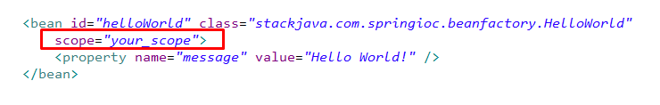
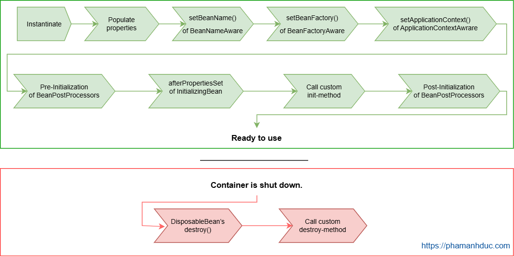

Nội dung cần chuẩn bị:
- Khởi tạo dự án SpringBoot
- Bean trong SpringBoot: Bean là gì, BeanFactory là gì, vòng đời của 1 Bean ở trong SpringBoot
- String MVC : @Controller, Thymeleaf
- 1 số Annotation trong SpingBoot: @SpringBootApplication, @Component, @Bean, @Autowired
- Lombok: @Getter, @Setter, @ToString, @Data, @Builder, @Constructior
- Log trong SpringBoot : Log4j là gì và Antotation @Slf4j

# Buổi 2 - Spring MVC

# 1. Bean trong SpringBoot
### 1.1 Bean là gì?
Trong mô hình của Spring Framework, **Bean** là các object mà IoC Container quản lý. Chúng là những thành phần cốt lõi được sử dụng để xây dựng ứng dụng. Bất kỳ đối tượng nào được khởi tạo, lắp ráp và quản lý bởi Spring IoC Container đều được gọi là Bean. Container này xử lý việc tạo ra và quản lý các Bean, bao gồm cả vòng đời của chúng từ khởi tạo đến hủy bỏ.

Theo như tài liệu chính thức của Spring, chúng ta chỉ nên định nghĩa các bean cho các service object, data access object (DAO), presentation object và các object dựng nên cơ sở hạ tầng của Spring như Hibernate SessionFactories, JMS Queues, v.v.   

##### a. Các loại bean
Nói đúng hơn thì gọi là các scope, phân loại dựa trên số lượng bean được tạo ra. Bean gồm có 5 scope:

- **Singleton:** Chỉ duy nhất một thể hiện của bean sẽ được tạo cho mỗi container. Đây là scope mặc định cho spring bean. Khi sử dụng scope này cần chắc chắn rằng các bean không có các biến/thuộc tính được share.
- **Prototype:** Một thể hiện của bean sẽ được tạo cho mỗi lần được yêu cầu(request)
- **Request:** giống với prototype scope, tuy nhiên nó dùng cho ứng dụng web, một thể hiện của bean sẽ được tạo cho mỗi HTTP request.
- **Session:** Mỗi thể hiện của bean sẽ được tạo cho mỗi HTTP Session
- **Global-Session:** Được sử dụng để tạo global sesion bean cho các ứng dụng Portlet.

##### b. Cách định nghĩa Bean
Có 3 cách định nghĩa class là một bean:
- **Khai báo trong file XML**

- **Sử dụng các Annotation Đánh Dấu Lên Class:**
Khi bạn muốn Spring tự động nhận biết và quản lý một Bean, bạn có thể sử dụng các annotation như @Component, @Service, @Repository, và @Controller. Mỗi annotation này có một ý nghĩa riêng, phù hợp với loại “món đồ” mà bạn muốn đặt trong “ngôi nhà” của mình.

- **@Component:** Đây là cách chung nhất để đánh dấu một Bean. Nó cho biết đây là một đối tượng của ứng dụng mà bạn muốn Spring quản lý.
- **@Service:** Dùng cho các lớp thực hiện xử lý logic nghiệp vụ.
- **@Repository:** Sử dụng cho các lớp làm việc trực tiếp với cơ sở dữ liệu.
- **@Controller:** Đặc biệt dành cho các lớp xử lý các yêu cầu HTTP, đóng vai trò như một cầu nối giữa người dùng và ứng dụng của bạn.
- **Ví dụ:**
```Java
@Service
public class BookService {
    // Logic nghiệp vụ để quản lý sách
}
```

- **Sử dụng @Bean Đánh Dấu Lên Method:**
Phương pháp thứ hai là định nghĩa Bean trong một lớp Java với annotation @Configuration. Đây là cách tạo Bean một cách rõ ràng hơn, thường được sử dụng khi bạn cần cấu hình chi tiết hơn hoặc tạo Bean theo điều kiện đặc biệt.

Trong lớp @Configuration, bạn sẽ định nghĩa các phương thức trả về đối tượng của Bean, và mỗi phương thức này được đánh dấu bằng @Bean. Điều này cho Spring biết rằng mỗi đối tượng trả về từ phương thức là một Bean và nên được quản lý bởi IoC Container.

Ví dụ:
```Java
@Configuration
public class AppConfig {
    @Bean
    public BookService bookService() {
        return new BookService();
    }
}
```
Trong ví dụ này, bookService là một Bean được tạo ra và quản lý bởi Spring. Khi ứng dụng của bạn chạy, Spring sẽ tìm trong các lớp @Configuration để tạo và cấu hình các Bean theo định nghĩa.

Mỗi cách trên có ưu điểm riêng và tùy thuộc vào nhu cầu cụ thể của ứng dụng bạn đang xây dựng, bạn có thể lựa chọn cách thức phù hợp để “đặt món đồ” vào “ngôi nhà” của mình. Việc lựa chọn đúng cách không chỉ giúp ứng dụng của bạn chạy trơn tru mà còn dễ dàng bảo trì và mở rộng trong tương lai.


##### c. Component scan
Khi ứng dụng Spring Boot bắt đầu chạy, thì nó sẽ tìm hết các class đánh dấu là `@Bean` trong chương trình và tạo bean. Quá trình tìm kiếm các bean này gọi là Component scan.

Component scan sẽ tìm toàn bộ class ở package cùng cấp hoặc các package thấp hơn.

Do đó, class đánh dấu `@SpringBootApplication` có chứa main method sẽ là nơi bắt đầu. Spring Boot sẽ tìm từ package này (package gốc) tìm xuống để tạo các bean.

**Tùy chỉnh package tìm kiếm:**
```Java
// Cách 1 dùng @ComponentScan với 1 hoặc nhiều string (cần có {})
@ComponentScan("com.tonghoangvu.demo.components")

// Cách 2 thêm thuộc tính @SpringBootApplication scanBasePackages
@SpringBootApplication(scanBasePackages = {
    "com.project.demo.components",
    "com.project.demo.controllers"
})
public class DemoApplication {
    public static void main(String[] args) {
        ...
    }
}
```

### 1.2 BeanFactory
BeanFactory là một `interface org.springframework.beans.factory.BeanFactory` (phổ biến nhất là XmlBeanFactory) trong Spring, chịu trách nhiệm tạo và quản lý các bean. Nó cung cấp các phương thức để lấy bean từ container Spring, tạo ra chúng khi cần thiết, và xử lý việc tiêm các phụ thuộc. BeanFactory là một phần của nền tảng IOC (Inversion of Control) trong Spring.


### 1.3 Bean life cycle

- IoC container tạo bean bằng cách gọi constructor (có thể inject các bean dependency vào đây)
- Gọi các setter method để inject các bean vào bằng setter based injection
- Các method khởi tạo khác được gọi (không cần quan tâm nhiều)
- @PostConstructor được gọi
- Init method được gọi
- Sau đó bean sẽ sẵn sàng hoạt động. Nếu sau đó bean không dùng nữa thì nó sẽ được hủy
- Gọi @PreDestroy
- Hủy bean như các object thông thường

Instantiate
Spring khởi tạo bean bằng cách gọi constructor của nó.

Populate properties
Sau khi khởi tạo, Spring chèn giá trị, tham chiếu đến bean khác (dependency) cho các thuộc tính của bean.

Aware interface
Spring cung cấp một vài Aware Interface cho phép bạn truy cập vào các hoạt động bên trong của Spring. Bean của bạn có thể truy cập được vào Spring context, bean factory bằng cách implement interface của chúng.

BeanNameAware interface
Nếu bean của bạn cần biết ID của nó trong Spring Container. Hãy implement BeanNameAwere interface và override method setBeanName. Spring sẽ gọi phương thức setBeanName và truyền ID của bean đó.

```Java
@Component
public class FileManager implements BeanNameAware{;
    @Override
    public void setBeanName(String name) {
        System.out.println(String.format("Bean's name is %s", name));
    }
    // The ouput will be: Bean's name is fileManager
}
```

BeanFactoryAware interface
Đậu của bạn có thể cần truy cập đến Bean Factory mà đã tạo ra nó. Chẳng hạn truy cập vào Bean Factory và lấy một tham chiếu đến thằng bean khác.

ApplicationContextAware interface
Tương tự như BeanFactoryAware interface. Nếu bạn cần lấy những thằng bean khác hoặc truy cập vào các tài nguyên. Hãy implement ApplicationContextAware interface, override callback method setApplicationContext, nó sẽ được gọi bởi Spring.

**@PostConstructor và @PreDestroy**
Đây là hai event khá quan trọng với bean, bạn có thể hook một method vào đó để thực thi khi event xảy ra:

**@PostConstruct** là sau khi bean đã khởi tạo xong
**@PreDestroy** là trước khi bean bị phá hủy
Chúng ta dùng hai annotation trên đánh dấu lên method nào đó, method đó sẽ được tự động gọi khi sự kiện bean xảy ra.

# 2. Các annotation cơ bản trong Spring
#### 2.1 @Autowire
Tự động nhúng các bean được Spring Container sinh ra vào các class được khai báo `@Autowire` (theo cơ chế Dependency Injection)
→ Cơ chế khi Spring bắt đầu chạy nó sẽ quét qua các lớp có sử dụng annotation để tạo Bean.
→ Đồng thời sẽ tìm kiếm xem trong các bean đó có khai báo `@Autowire` không, nó sẽ tìm kiếm các bean tương ứng để tiêm (Injection) vào bean đó.
Sử dụng `@Autowire` với 3 trường hợp sau:   
- Constructor injection
- Setter injection
- Field injection

#### 2.2 @Configuration
Được sử dụng để chỉ ra rằng, Class khai báo sử dụng `@Configuration` sẽ khai báo một hoặc nhiều `@Bean` method trong class đó.
→ Thông thường các Bean cấu hình trong dự án ta sẽ để trong các lớp configuration này. Ví dụ cấu hình Elasticsearch, Thymeleaf, đa ngôn ngữ,…

#### 2.3 @Bean
Đánh dấu trên method thông báo cho Spring, method đó sẽ sinh ra một bean và được quản lí bởi Spring Container.
→ Tất cả các Method sử dụng annotation @Bean phải nằm trong class Configuration.
```Java
@Configuration
public class WebDriverConfig {

    @Bean
    public WebDriver Chrome() {
        System.setProperty("webdriver.chrome.driver", "/Downloads/chromedriver_linux64/chromedriver");
        return new ChromeDriver();
    }
}
```
#### 2.4 @ComponentScan
Sử dụng annotation này để thông báo cho spring container rằng: “Phải biết vào các package nào trong dự án để quét các Annotation và tạo Bean.”

#### 2.5 @Component
Khi một class sử dụng annotation này: “Thì sẽ được tạo thành 1 Bean, và tiêm vào các lớp nào cần dùng tới nó”
Sẽ không thể @Autowire một lớp nếu lớp đó không sử dụng @Component, khi bạn muốn xác định lớp để Injection thì phải đánh dấu bằng cách sử dụng annotation này để spring biết. Còn các @Bean trong @Configuration sẽ được tự động phát hiện

#### 2.6 @Service
Đây là annotation đặc biệt của @Component. Được dùng để sử lý nghiệp vụ, logic.
```Java
@Service
public class UserService {

    @Autowired
    UserRepository userRepository;

    @Autowired
    FacebookUtil facebookUtil;
}
```

#### 2.7 @Repository
- Đây là một annotation đặc biệt của @Component. Được dùng để thao các với cơ sở dữ liệu.
- **JPA** sẽ cung cấp cho các hàm select, update,... cơ bản. Có thể áp dụng thêm Query Creation.
```Java
@Repository
public interface UserRepository extends JpaRepository <User, Integer> {
    //Query Creation
}
```

# 3. Lombok
Lombok là một thư viện Java giúp tự sinh ra các hàm `setter/getter, hàm khởi tạo, toString… và tinh gọn chúng.` Tuy nhiên với những class có nhiều thuộc tính thì việc hiển thị các hàm getter/setter hay các hàm toString sẽ khiến cho class bị rối. Lombok sinh ra chính là để khắc phục những điểm đó.

#### 3.1 @Getter, @Setter
- Annotion @Getter @Setter sẽ giúp sinh ra các  method getter/setter
- Ngoài cách dùng annotation @Getter @Setter trước các field ta có thể dùng trước class để áp dụng cho tất cả các field

#### 3.2 @AllArgsConstructor và @NoArgsConstructor
- Giúp tạo ra các hàm khởi tạo với tất cả các tham số và hàm khởi tạo không tham số
#### 3.3 Annotation @ToString @EqualsAndHashCode 
- Giúp tạo ra các hàm equal và toString theo tất cả các thuộc tính.
- Nếu bạn chỉ muốn equal hay toString cho một số field thì có thể dùng thêm thuộc tính exclude:

Ví dụ mình chỉ muốn toString trả về name, và hàm equal theo name:
```Java
@ToString(exclude="address")
@EqualsAndHashCode(exclude="address")
public class Person {
  @Getter @Setter private String name;
  @Getter @Setter private String address;
}
```
#### 3.4 @Data
- Annotation **@Data** sẽ tương đương với annotation **@Getter + @Setter + @ToString + @EqualsAndHashCode + @NoArgsConstructor**

#### 3.5 @Builder
- Giống constructor...

# 4. Log: Log4j + @Slf4j
**Log4j là gì?**

Log4j là một thư viện mã nguồn mở được phát triển bởi Apache Software Foundation, dùng để ghi nhật ký (logging) trong các ứng dụng Java. Nó giúp các nhà phát triển theo dõi, gỡ lỗi và giám sát hoạt động của ứng dụng thông qua việc ghi lại các sự kiện, thông báo lỗi, và các thông tin quan trọng khác.

**Các tính năng chính của Log4j:**

Cấp độ logging linh hoạt: Log4j hỗ trợ nhiều cấp độ như DEBUG, INFO, WARN, ERROR, và FATAL, cho phép bạn kiểm soát mức độ chi tiết của thông tin được ghi lại.

Cấu hình dễ dàng: Bạn có thể cấu hình Log4j thông qua các tệp tin như XML, JSON, hoặc properties, giúp tùy chỉnh cách thức và nơi lưu trữ log.

Hỗ trợ nhiều đích đến (Appenders): Log4j cho phép gửi log đến nhiều nơi khác nhau như console, file, database, hoặc các hệ thống quản lý log tập trung.

Hiệu suất cao: Được thiết kế để tối ưu hiệu suất và giảm thiểu tác động đến ứng dụng.

**Annotation @Slf4j là gì?**

@Slf4j là một annotation được cung cấp bởi thư viện Project Lombok, giúp tự động tạo ra một instance của logger sử dụng SLF4J (Simple Logging Facade for Java) cho lớp Java của bạn. Thay vì phải khai báo và khởi tạo logger thủ công, bạn chỉ cần sử dụng annotation này, và Lombok sẽ làm phần còn lại cho bạn.

**Cách sử dụng @Slf4j:**

Thêm Lombok vào dự án:

Nếu sử dụng Maven, thêm dependency sau vào tệp pom.xml:
```xml
<dependency>
    <groupId>org.projectlombok</groupId>
    <artifactId>lombok</artifactId>
    <version>1.18.24</version> <!-- Kiểm tra phiên bản mới nhất -->
    <scope>provided</scope>
</dependency>
```

```Java
import lombok.extern.slf4j.Slf4j;

@Slf4j
public class ExampleClass {
    public void performTask() {
        log.info("Task is being performed.");
    }
}
```
Trong ví dụ trên, Lombok sẽ tự động tạo ra một logger có tên log, cho phép bạn sử dụng các phương thức như **log.info(), log.debug(), log.error(), v.v.**

**Lợi ích của việc sử dụng @Slf4j:**

Giảm mã lặp lại: Không cần phải khai báo và khởi tạo logger thủ công trong mỗi lớp.

Đồng nhất: Đảm bảo việc sử dụng cùng một framework logging (SLF4J) trong toàn bộ dự án.

Tiện lợi: Tăng tốc độ phát triển và giảm khả năng mắc lỗi.

**Lưu ý:**

Cài đặt Lombok trong IDE: Để Lombok hoạt động chính xác, bạn cần cài đặt plugin Lombok cho IDE mà bạn đang sử dụng (như Eclipse, IntelliJ IDEA, hoặc NetBeans).

SLF4J là một facade: Điều này có nghĩa là nó cung cấp một giao diện chung cho các framework logging khác nhau. Bạn cần thêm một implementation cụ thể (như Log4j, Logback) vào dự án để log hoạt động thực sự.