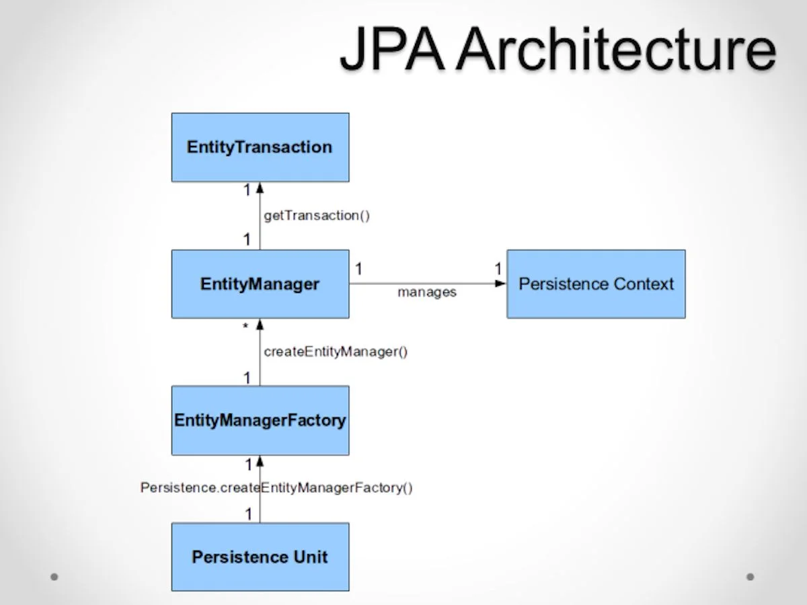
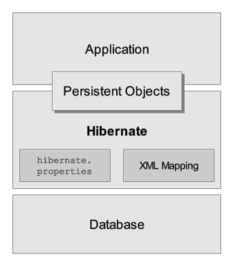
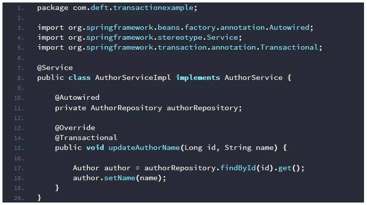

- Triển khai RestfullAPI trong Spring Boot
- JPA là gì? Hibernate là gì?
- Tìm hiểu các Annotation : @RestController, @Service, - @Repository, @Entity, @Table, @Id, @Transactional, @Query ...
- Bài tập: Làm 1 ứng dụng CRUD quản lý thông tin thành viên clb. Dùng @RestController để viết enpoint của API, dùng @Service để xử lý các logic CRUD, @Repository để xử lý thao tác với database, @Entity để tạo các ORM với dtb

# Buổi 3 - CRUD

# 1. Jpa, Hibernate
### 1.1 JPA
**JPA (viết tắt của Java Persistence API)** là một tiêu chuẩn kỹ thuật trong lĩnh vực phát triển ứng dụng Java để lập trình **đối tượng quan hệ (ORM)**. JPA được cung cấp bởi Oracle và đã được thừa nhận là một tiêu chuẩn quốc tế.

Trong quá trình phát triển ứng dụng Java, chúng ta không thể tránh khỏi việc tương tác với cơ sở dữ liệu. Vấn đề là, làm thế nào để lưu trữ và truy xuất dữ liệu một cách dễ dàng và hiệu quả?

Một giải pháp là sử dụng **JDBC (Java Database Connectivity)**, một API được cung cấp bởi Sun Microsystems để tương tác với cơ sở dữ liệu. Tuy nhiên, với JDBC, chúng ta cần phải viết rất nhiều code để thực hiện các hoạt động đơn giản như việc lấy và cập nhật dữ liệu. Điều này có thể làm cho ứng dụng của chúng ta trở nên phức tạp và khó bảo trì.

Vì vậy, JPA ra đời nhằm giải quyết vấn đề này bằng cách giảm bớt sự phức tạp của việc tương tác với cơ sở dữ liệu. Với JPA, ta có thể sử dụng đối tượng Java để lưu trữ và truy xuất dữ liệu. Hơn nữa, JPA sẽ tự động chuyển đổi các đối tượng thành các câu truy vấn SQL để thực hiện việc lưu trữ và truy xuất, giúp lập trình viên chúng ta tập trung vào việc phát triển tính năng của ứng dụng mà không phải lo nhiều về SQL phức tạp.

**> Lợi ích:**
- Viết ít code hơn.
- Performance tốt.
- Độc lập về database.
- Không phải làm việc với SQL.
- Hỗ trợ cấu hình triển khai bằng annotation và xml.
- Có nhiều framework ORM miễn phí hỗ trợ có thể dùng để phát triển nhiều loại ứng - dụng khác nhau.
- JPA là một đặc tả đã được chuẩn hóa và là một thành phần trong đặc tả EJB 3.
- Dễ dàng chuyển từ một ORM này sang một ORM khác. Ví dụ từ iBatis sang Hibernate.

**Kiến trúc JPA:**


- **Entity:** là các đối tượng thể hiện tương ứng 1 table trong cơ sở dữ liệu. Entity thường là các class POJO đơn giản, chỉ gồm các phương thức getter, setter.
    - Một số đặc điểm của một Entity:
        - Entity có thể tương tác với cơ sở dữ liệu quan hệ.        
        - Entity được xác định thông qua một định danh (id), tương đương với khóa chính trong table của cơ sở dữ liệu quan hệ.    
        - Entity hỗ trợ transaction.   
        - Entity hỗ trợ kế thừa giống như những class Java khác.
- **EntityManager:** EntityManager là một interface cung cấp các API cho việc tương tác với các Entity.
    - Một số chức năng cơ bản của EntityManager như:
        - Persist: phương thức này dùng để lưu một thực thể mới tạo vào cơ sở dữ liệu.
        - Merge: dùng để cập nhật trạng thái của entity vào cơ sở dữ liệu.
        - Remove: xóa một instance của entity.
- **EntityManagerFactory:** EntityManagerFactory được dùng để tạo ra một instance của EntityManager.
- **EntityTransaction**: Một Transaction là một tập hợp các thao tác trong đó tất cả các thao tác phải được thực hiện thành công hoặc tất cả thất bại.
    - Một database transaction bao gồm một tập hợp các câu lệnh SQL được committed - hoặc rolled back trong một unit.
    - EntityTransaction có quan hệ 1-1 với EntityManager. Bất kỳ thao tác nào được bắt đầu thông qua đối tượng EntityManager đều được đặt trong một Transaction. Đối tượng EntityManager giúp tạo EntityTransaction.

### 1.2 ORM (Object-Relational Mapping) 
là một kỹ thuật trong lập trình để ánh xạ các đối tượng Java vào cơ sở dữ liệu quan hệ. Khi sử dụng ORM, chúng ta có thể làm việc với cơ sở dữ liệu thông qua các đối tượng Java, thay vì phải sử dụng các câu truy vấn SQL trực tiếp.

Có nhiều framework hỗ trợ ORM và JPA được liệt kê phía dưới:

- **Hibernate:** Hibernate là một trong những framework ORM phổ biến nhất và cũng là - backend mặc định cho JPA. Nó cung cấp các tính năng mạnh mẽ và linh hoạt cho - việc tương tác với cơ sở dữ liệu quan hệ.
- **EclipseLink**: EclipseLink là một framework ORM mạnh mẽ khác được sử dụng rộng rãi - trong cộng đồng Java. Nó cũng hỗ trợ đầy đủ JPA.
- **OpenJPA:** OpenJPA là một framework ORM được phát triển bởi Apache. Nó cung cấp một loạt các tính năng để làm việc với cơ sở dữ liệu quan hệ và hỗ trợ đầy đủ JPA.

### 1.3 Hibernate
**Hibernate** là 1 ORM (Object Relational Mapping) framework cho phép người lập trình thao tác với database một cách hoàn toàn tự nhiên thông qua các đối tượng. Lập trình viên hoàn toàn không cần quan tâm đến loại database sử dụng, SQL…

Hay nói cách khác, Hibernate chính là cài đặt của JPA (JPA là 1 tập các interface, còn Hibernate implements các interface ấy 1 cách chi tiết).

Kiến trúc Hibernate:


=> Phân biệt:
- JPA là một tiêu chuẩn, Hibernate là một triển khai. Điều này có nghĩa là JPA chỉ định nghĩa các đặc tả cần thiết và không có code hiện thực từ những đặc tả đó.
- JPA sử dụng **JPQL (Java Persistence Query Language)**, Hibernate sử dụng **HQL (Hibernate Query Language)**. JPQL và HQL đều là các ngôn ngữ truy vấn dựa trên SQL, nhưng có một số khác biệt về cú pháp và chức năng. JPQL là một phần của tiêu chuẩn JPA, do đó nó được hỗ trợ bởi tất cả các triển khai JPA. HQL là một ngôn ngữ truy vấn riêng biệt của Hibernate, do đó nó chỉ được hỗ trợ bởi Hibernate.
- JPA tuân thủ tiêu chuẩn, Hibernate mở rộng tiêu chuẩn. Điều này có nghĩa là JPA chỉ cung cấp các tính năng cơ bản cho ORM, trong khi Hibernate cung cấp nhiều tính năng nâng cao và tùy biến cho ORM. Ví dụ: JPA chỉ hỗ trợ hai loại bộ nhớ đệm: bộ nhớ đệm thực thể (entity cache) và bộ nhớ đệm truy vấn (query cache). Hibernate hỗ trợ ba loại bộ nhớ đệm: bộ nhớ đệm thực thể, bộ nhớ đệm truy vấn và bộ nhớ đệm về các cấu trúc dữ liệu (collection cache).

# 2. Một số annotation
### 2.1 @RestController, @Service, @Repository
- Đã trình bày ở buổi 2
### 2.2 @Entity, @Table

Để định nghĩa một Entity trong JPA, chúng ta có thể sử dụng các annotation như **@Entity, @Table, @Column, vv**. Dưới đây là một ví dụ:

```Java
@Entity
@Table(name = "employees")
public class Employee {
    @Id
    @GeneratedValue(strategy = GenerationType.IDENTITY)
    private Long id;
    
    @Column(name = "name")
    private String name;
    
    // getters and setters
}
```
Ở ví dụ trên, **Employee** được đánh dấu là một Entity bằng cách sử dụng annotation **@Entity**. Sẽ ánh xạ vào bảng `"employees"` trong cơ sở dữ liệu thông qua **@Table(name = tên_bảng)**. 
Thuộc tính id được đánh dấu là khóa chính bằng cách sử dụng annotation **@Id**. Các thuộc tính khác được ánh xạ vào các cột của bảng bằng cách sử dụng annotation **@Column(name = tên_cột)**.

### 2.3 @Transactional
**@Transactional** annotation sẽ nói với Spring rằng updateAuthorName() method cần được thực thi bên trong một transaction. Khi bạn sử dụng AuthorService ở một nơi nào nó, chẳng hạn như ở các controller class, Spring sẽ tạo ra một proxy object bao bọc AuthorService object và cung cấp các đoạn mã cần thiết để bắt đầu một transaction.



Mặc định, proxy sẽ start một transaction trước khi có một yêu cầu đến method được chú thích với **@Transactional** annotation. Sau khi method thực thi xong, proxy sẽ commit hoặc rollback transaction nếu có một RuntimeException hoặc Error xảy ra trong quá trình thực thi. Mọi thứ xảy ra ở giữa, chỉ là các đoạn mã code thực thi logic business do chính chúng ta viết.

@Transactional annottion còn hỗ trợ cho chúng ta tuỳ biến một các hành vi của một transaction thông qua một số thuộc tính quan trọng như propagation, readOnly, rollbackFor, noRollbackFor.

------------------
Trên lớp:
- ORM (liên quan đến Java Reflect), ko quan tâm đến getter, setter
- ORM là trung gian giữa **Result Set** (lấy từ DB) và object nhận được.
- Bản chất nếu cần - (tìm hiểu **Servlet**)
- JDBC bản chất: JDBC template 
  - JDBC: đầu vào là String -> dữ liệu trả về là thô (bảng - mảng 2 chiều), chưa rõ được là object, dữ liệu được thể hiện thế nào
  - JPA: đầu vào là 1 object cụ thể -> đầu ra cũng sẽ là loại đó

- JPQL: độc lập với CSDL 
  - native query: thuần SQL

- Twitter / Instagram ID generate --- Snowflake